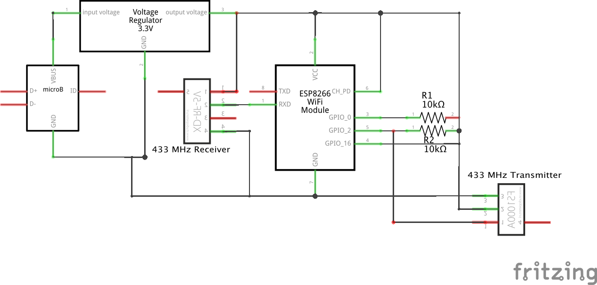

# ESP-01-433MHz-Transceiver
A Home-Assistant compatible 433 MHz RF-Transceiver for controlling RF sockets using ESP-01 and ESPHome.

Setting up an external component for Home-Assistant is really easy using the ESPHome library. This project contains the configuration files for controlling 433 MHz RF-sockets from within Home-Assistant.

## Requirements
### Software
* Home-Assistant set up
* ESPHome installed
* Optionally a MQTT broker to receive RF-codes

### Hardware
* ESP-01
* RF-Transmitter, RF-Receiver: [example](https://www.amazon.de/Anpro-Empfänger-Superregeneration-Transmitter-Einbrecher/dp/B071J2Z3YK/ref=sr_1_1_sspa?__mk_de_DE=ÅMÅŽÕÑ&crid=34DIB0CD5N1ND&dchild=1&keywords=433+mhz+sender+empfänger&qid=1587153757&sprefix=433%2Caps%2C164&sr=8-1-spons&psc=1&spLa=ZW5jcnlwdGVkUXVhbGlmaWVyPUFNTUZVSkJLQUFGMVQmZW5jcnlwdGVkSWQ9QTEwMzk1Nzg4MlVKUUI1R0ZJRzEmZW5jcnlwdGVkQWRJZD1BMDU1MjM0MzEyNEREN0xNTDYwSDUmd2lkZ2V0TmFtZT1zcF9hdGYmYWN0aW9uPWNsaWNrUmVkaXJlY3QmZG9Ob3RMb2dDbGljaz10cnVl)
* Micro-USB port: [example](https://www.amazon.de/Stromversorgung-Converter-Board-TOOGOO-Schnittstelle-Wie-Abbildung-gezeigt/dp/B01L1P57QY/ref=sr_1_6?__mk_de_DE=ÅMÅŽÕÑ&dchild=1&keywords=micro+usb+platine&qid=1587153831&sr=8-6)
* 3.3 V voltage regulator: [example](https://www.amazon.de/iHaospace-AMS1117-3-3-Voltage-Regulator-4-75V-12V/dp/B07DJZKMYM/ref=sr_1_25?__mk_de_DE=ÅMÅŽÕÑ&dchild=1&keywords=3%2C3v+spannung&qid=1587153910&sr=8-25)
* 2x10kohm resistor

## Electric Diagram

## Set Up
In order to set things up, you need to need to rename [secrets_template.yml](secrets_template.yaml) to `secrets.yaml` and fill in the required passwords.
Afterwards you can flash the software to your ESP-01 device.

## Integration in Home-Assistant
To integrate the component in Home-Assistant you need to choose the ESPHome-integration which will discover and integrate your RF-Transceiver automatically.
